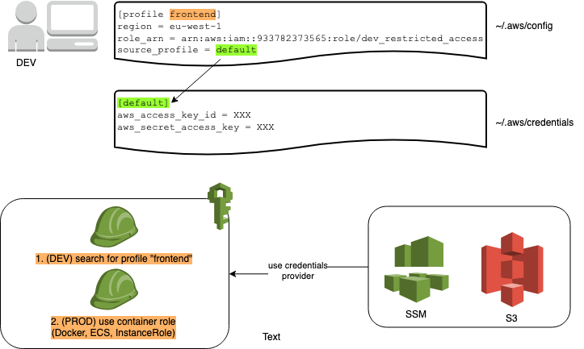

Welt Content API Client
=======================

Build
-----

    ./sbt clean coverage test
    ./sbt coverageReport
    ./sbt coverageAggregate

Local Development (with an ApiClient-Project)
---------------------------------------------

There is no need to do a full dev cycle (publish to bintray and bump the version in the other project)
each time something changes. For this use case you can benefit from _SNAPSHOT_ releases. Set the version to
`version := "0.2.1-SNAPSHOT",` and then do a

    ./sbt publishLocal

in the other project, enable resolving vom local caches by adding a resolver `Resolver.mavenLocal` and also
switch to the same _SNAPSHOT_ version.

Publish
-------
Publishing Versions is done by commiting to master. CI [Jenkins](https://jenkins.up.welt.de/job/funkotron/job/WeltContentApiClient/job/WeltContentApiClientPipeline/) will take care of the rest for you.

(!) Bump the version in file `build.sbt`, otherwise you will get an error when publishing a version that already exists.

We are using the [bintray sbt plugin](https://github.com/softprops/bintray-sbt).

Deploying from local
--------------------
You will need a [bintray](https://bintray.com/) account. Log in through sbt:

	./activator bintrayChangeCredentials

Then you can publish new releases with:

	./sbt publish
	
Service Authentication
----------------------



- when using the _wcapi_ on your machine (_funkotron_) it is required to:
    - Have a valid AWS account, including `credentials` (`access key` and `secret access key` -> ask your admin).
    The easiest way is to [install the AWS CLI][aws_cli] and then execute `aws configure`.
    - Have the `frontend` profile configured as follows:

~/.aws/config
```
[profile frontend]
region = eu-west-1
role_arn = arn:aws:iam::933782373565:role/dev_restricted_access
source_profile = default
```

~/.aws/credentials
```
[default]
aws_access_key_id = XXX
aws_secret_access_key = XXX
```

- the _AWS services_ (e.g. S3, SSM and all the future services) are required to use the `Credentials` provided by the _wcapi_

```scala
import com.amazonaws.auth.AWSCredentialsProvider
import de.welt.contentapi.core.client.services.configuration.ApiConfiguration
import scala.util.Try

val credentials: Try[AWSCredentialsProvider] = ApiConfiguration.aws.credentials
```

- Configurations are automatically loaded from SSM
- local overrides can be provided by writing a file to `~/.welt/frontend-overrides.conf`, e.g.:

```hocon
s3 {
  raw_tree {
    bucket: "not-the-prod-bucket"
    file: "/not/the/prod/file.json"
  }
}
```

- client projects should generate a standardized `version.conf`, please add this to your `build.sbt`:

```sbt
resourceGenerators in Compile += Def.task {
  val file = (resourceDirectory in Compile).value / "version.conf"
  IO.write(file,
    s"""build_info {
       |    version  = "${version.value}"
       |    revision = "${git.gitHeadCommit.value.getOrElse("cannot_detect_git_revision")}"
       |    module   = "${packageName.value}"
       |    date     = "${if (version.value.contains("local")) "prevent reload loops in local dev" else java.time.Instant.now()}"
       |}""".stripMargin)
  Seq(file)
}.taskValue
```

[aws_cli]: https://docs.aws.amazon.com/cli/latest/userguide/cli-chap-install.html